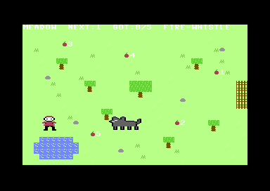

# 🐺 Peter and the Wolf

A small storybook game, inspired by Prokofiev's *Peter and the Wolf* — and by a childhood dream of "a wolf moving across the screen, looking for Peter."

You play **Peter**, sneaking through a green meadow to gather apples and slip home through the **gate** before the **wolf** sniffs you out.

Everything — the meadow, the trees, Peter, the wolf, and the music cues — is drawn and synthesized in code. **No image or sound files**, just a single `index.html`.

## ▶️ Play

**Play it online: <https://robertorenz.github.io/peter/>** (hosted on GitHub Pages —
works on desktop, and on tablets/phones with the touch controls).

Or open `index.html` in any modern browser. That's it.

📖 **[Player's manual](https://robertorenz.github.io/peter/manual.html)** — a storybook
guide to the controls, the six chapters, the numbered-apple rules and the wolf's
habits (`manual.html` locally; also linked from the game's title page).

The game **fills the whole browser window**: on big screens everything — the meadow,
the HUD, the story cards — scales up together (with the canvas re-rendered at full
resolution, so it stays crisp), and on small screens it shrinks to fit.

### 🖥️ Windows exe

A standalone desktop build (game + orchestral music, no browser needed) lives in
`desktop/`. To build the portable exe:

```
cd desktop
npm install
npm run dist        # → desktop/dist/PeterAndTheWolf.exe (single portable file)
```

`npm run dist` copies the current `index.html` and `audio/` from the repo root,
then packages them with Electron. `desktop/dist/win-unpacked/` holds the same app
as a folder if you prefer not to use the portable exe.

## 🎮 Controls

| Action | Keys |
| --- | --- |
| Move | `W` `A` `S` `D` or arrow keys |
| Tip-toe (quiet, slower) | hold `Shift` |
| Throw apple / search / spring the trap / shake a tree | `Space` |
| Whistle (calls a friend / sends the bird at the wolf — but predators hear it) | `E` |
| Drop the rope (level 4 — carrying it slows you and blocks throwing) | `Q` |
| Photo mode (hide the HUD) | `H` |
| Pause | `P` |
| Mute / unmute | `M` |
| **Touch screens** | drag the **left half** to walk, tap the **right half** to act; edge buttons **🤫 tip-toe** (toggle, glows gold while on) and **♪ whistle** |

## ✨ Game feel

- **Three hearts** per level — the wolf nipping you costs a heart (with a knock-back
  and a moment of invulnerability) instead of ending the run outright.
- **The wolf pounces**: when it gets close it crouches with a flashing **❗**, then
  leaps in a straight line — sidestep the telegraph to survive.
- **Score, stars & best**: apples, speed and hearts kept all earn points; each level
  ends with a ★-rating and your best total is saved between sessions.
- **A real capture scene**: setting the trap tosses the rope over the oak's branch,
  where the noose dangles and sways; springing it plays a full cutscene — the rope
  snaps around the wolf's tail, yanks it under the branch and **hauls it up into the
  tree**, upside-down and kicking, while Grandpa hurries over and the branch creaks.
- **The Triumphal Procession**: after every capture, a letterboxed, skippable parade
  cutscene plays to the Hunters' March — Peter marches in front with a golden pennant,
  the bird loops overhead, **two hunters carry the sleeping wolf slung from a pole**,
  and Grandpa, the cat and the duck follow through a sunset meadow under falling
  confetti. Press `Space` (or tap) to skip.
- **A minimap** in the corner of every big scrolling level shows friends, foes and the goal.
- **Each level has its own light**: day meadow, golden afternoon with drifting leaves,
  blue dusk, and a night forest full of fireflies — and the light slowly drifts as a
  level wears on, day turning golden and dusk deepening toward night.
- **Weather moments**: now and then a soft drizzle passes over the meadow (rain
  streaks, ripple rings in the grass, the sun shafts hiding behind the clouds), or a
  gust of wind bends every tree and sends loose leaves racing sideways.
- **Little lives**: when nothing threatens them, the bird takes a wriggling dust bath
  and the duck pauses mid-swim to preen its wing; the cat drops into a low creeping
  stalk when it spots the bird; and Peter waves hello when the dove glides past.
- **A living meadow**: cloud shadows drift across the grass, soft sun shafts and sunlit
  patches warm the day levels, wind waves ripple through swaying grass and real petaled
  flowers, butterflies flutter between blooms, dragonflies hover and dart, pollen floats
  in the light, an occasional dove glides overhead, fireflies wink at dusk and by night,
  a pair of hunters sometimes patrols through the trees, and the pond glitters around a
  drifting lily pad.
- **Character acting**: Peter blinks and his cap tassel swings as he runs, the wolf's
  ear flicks and its hunting eye pulses red, and both kick up little dust puffs at full
  speed. The cat is a proper ginger tabby with a swishing tail, and Grandpa potters
  about near the oak, cane tapping.
- **The wolf fears the hunters**: when the patrol wanders near, the wolf breaks off
  whatever it's doing and slinks away, tail tucked between its legs — use the moment
  to breathe (or to set your trap).
- **Predators hunt with their eyes**: on the rescue levels the cat and the wolf amble
  about until the bird or duck actually wanders into view — then a ❗ flashes, they
  give chase a little faster, and they lose the trail again if their prey slips far
  enough away. A stunned predator forgets what it saw.
- **A fifth level — Grandfather's Gate**: night has fallen, and Peter must walk old
  Grandpa home through the dark. The fireflies light only a small circle around Peter;
  beyond it, the meadow fades to black — and the wolf hunts whichever of the pair it
  can see.
- **The finale — The Great Chase**: one long, continuous sprint across a meadow four
  screens wide, the wolf at Peter's heels the whole way. The world crossfades from
  sunlit morning through golden afternoon and blue dusk into deep night as you run —
  and it ends when you lure the wolf under the old oak's waiting snare. The full
  orchestral recording plays it out.
- **Storybook interludes**: between levels, the win page shows a line from the actual
  tale (“Early one morning, Peter opened the gate…”) while the next character's
  leitmotif plays softly.
- **Named difficulty tiers**: finish all six adventures and the tale begins anew, a
  little wilder — <i>Storybook</i>, then <i>Wild</i>, then <i>Prokofiev</i>, shown
  beside the level name.
- **Photo mode**: press `H` to hide the whole HUD for a clean screenshot of the meadow;
  press it again to bring it back.
- **Footprints & sound**: Peter and the wolf press fading tracks into the grass (bright
  in the winter snow), and sprinting close past a tree or rock can *snap a twig* — a
  ripple of noise every predator turns toward. The whistle on level 1 now sends the
  scout bird diving at the wolf, pinning it for a moment.
- **The wolf learns**: hide in the same bush too long while it hunts and it sniffs the
  spot out for good (paw prints mark a blown hiding place) — faster on higher tiers.
- **Seasons by tier**: the *Wild* cycle turns the meadow to autumn (golden canopies,
  leaves on every level) and *Prokofiev* to winter (pine trees capped with snow,
  snowfall, pale light).
- **Living touches**: the cat sits to wash a paw mid-prowl, a startled dove flutters
  skyward if a wolf runs beneath it, and a far-off horn sounds a few seconds before
  the hunters arrive — bait the wolf toward it if you dare.
- **Chapter select & continue**: finish the tale once and the title page offers every
  chapter directly, plus **Endless Dusk** — survive a gathering pack of wolves (one
  more slips from the trees every twenty seconds) for points. Your run (chapter, tier
  and score) is saved, so you can close the browser and pick the tale back up.
- **A narrator**: tick "read the story aloud" and the storybook lines are spoken
  between chapters (browser speech, no downloads).
- **The curtain call**: after the Great Chase, the whole cast lines up on a spotlit
  stage — Peter waving, the cat washing, the wolf on its rope — under the tale's
  famous closing line about the duck.
- **The scout bird**: on the first level a little bird wheels and chirps above the
  wolf wherever it prowls, so you always know where danger is — just as it taunts the
  wolf in the story.
- **Peter's whistle** (`E`): calls the bird or the duck to him from far across the
  meadow — but sound carries, and every predator within earshot comes to look.
- **Hiding bushes**: on the levels where the wolf hunts Peter himself, berry bushes
  dot the meadow — step inside and you vanish from the wolf's senses.
- **Shakeable trees**: out of apples? Stand at a tree and press `Space` to shake one
  or two loose — the racket draws the hunters' quarry straight toward you.
- Particles, screen shake and hurt-blinks make every splat, pickup and close call land.

## 🎯 How to win

1. **Collect every apple** scattered in the meadow — each apple wears a **number
   badge**, and they must be picked up **in order** (1, 2, 3, …). The next apple in
   the sequence glows gold, the HUD shows which number is next, and it shines as a
   brighter gold dot on the minimap. Touching the wrong apple does nothing but a
   gentle reminder.
   - **Throwing on the Meadow**: `Space` hurls an apple at the wolf — but apples
     leave the basket in **reverse order** (the last one gathered flies first). A
     hit **stuns the wolf** and the apple **bounces off** in the direction of the
     throw; a miss ricochets off **trees, rocks and the meadow's edge** instead.
     Wherever it comes to rest, it lies waiting with its number — and must be
     **fetched back in order** before the harvest is complete. Throwing below the
     full count also lets the oak snare back down until the basket is full again.
2. Then choose your ending:
   - **Escape** — slip home through the **gate** on the right, *or*
   - **Hero's ending** — once the apples are gathered, the rope flips up **over the
     old oak's branch** and hangs as a **snare**. Lure the wolf underneath and press
     `Space` — the noose snags its **tail** and hoists it up into the tree, where it
     dangles upside-down, flailing and swinging, just like in the story.
3. Don't let the wolf **catch you** — and don't let its **suspicion meter** fill up.

## 🎵 Music & friends

- Each level plays the **actual Prokofiev character leitmotif**, transcribed from the
  orchestral score: **Peter's theme** (strings) in the Meadow, the **Duck's theme**
  (oboe) in the rescue. They're played by a small in-code synth, so no audio files
  are required (press `M` to mute).
- Prefer the real orchestral recording? Drop a `peter-theme.mp3` into this folder and
  the game will loop it instead of the synth.
- The **🐦 bird** flutters near Peter and dive-bombs the wolf when it gives chase, breaking its focus.
- The **🦆 duck** paddles in the pond and dives underwater when the wolf prowls too close.

## 🎼 The themes (MIDI)

The `themes/` folder holds one MIDI file per character, transcribed from Prokofiev's
own "character motives" reference page of the score:

| File | Character | Instrument |
| --- | --- | --- |
| `01_peter.mid` | Peter | Strings |
| `02_duck.mid` | The Duck (Sonia) | Oboe |
| `03_bird.mid` | The Bird (Sasha) | Flute |
| `04_cat.mid` | The Cat (Ivan) | Clarinet |
| `05_grandfather.mid` | Grandfather | Bassoon |
| `06_wolf.mid` | The Wolf | French Horns |
| `07_hunters.mid` | The Hunters | March + Timpani |

These are careful transcriptions of each motif's **principal melodic line** (not the full
orchestration) and are easy to edit. Regenerate them with:

```
python tools/make_themes.py
```

## 🎻 Full-score OMR transcription

The leitmotifs above are only the short motifs. To transcribe the **whole orchestral
score**, the full IMSLP PDF was run through real Optical Music Recognition:

```
Audiveris (PDF page -> MusicXML)  ->  music21 (MusicXML -> MIDI)  ->  merge
   tools/run_omr.ps1                    tools/build_full_midi.py
```

Outputs:
- `omr/mid/p_NN.mid` — one multi-track MIDI per score page (each recognised staff = a track).
- `themes/PeterAndTheWolf_FULL.mid` — all pages concatenated into one ~17-minute,
  15-channel orchestral MIDI.

**Honest limitations:** Audiveris recognised **48 of 76 pages** (dense pages with
crescendo "wedges" trip its MusicXML exporter); it does **not** label instruments, so
parts are by staff position, and OMR on a 14-stave score makes pitch/rhythm errors.
So this is a **rough machine transcription of the whole work**, not a clean edition —
useful as a draft to listen to and correct, not a finished score. Regenerate the merge
with `python tools/build_full_midi.py`.

## 🐺 The wolf

The wolf has two moods:

- **Patrol** — it wanders the meadow calmly.
- **Hunt** — if it *sees* you (in the open, nearby) or *hears* you (running close by), its eyes glow red and it chases. Hide behind **trees** to break line of sight, and hold `Shift` to move quietly when it's near.

Each round adds more apples and a faster, sharper-eyed wolf.

Both Peter and the wolf are drawn with shaded, gradient-lit sprites (rosy cheeks and
a tasseled cap for Peter; a two-tone muzzle, pointed ears, bushy tail and glowing eyes
for the wolf) rather than flat shapes, to match the polish of the meadow scenery.

## 🕹️ Commodore 64 port (Level 1)

`c64/` holds a from-scratch 6502 assembly port of Level 1, **The Meadow**, for real
C64 hardware (or VICE). Gather the numbered apples in order, whistle (FIRE) to stun
the wolf, then escape through the gate on the right. Joystick in port 2.

- **Run it:** load `c64/build/meadow.d64` (or `meadow.prg`) in VICE — `x64sc build\meadow.d64`.
- **Tech:** Peter is a multicolor hardware sprite; the wolf is **two sprites side by
  side** (48px of muzzle, ears, ridge back and raised tail, auto-mirrored for facing)
  that hunts around obstacles; apples, trees, pond and gate are a custom character set
  overlaid on the ROM font; raster-IRQ-synced 50 Hz game loop.
- **Music:** Prokofiev on the SID — Peter's theme loops on voice 2 (pulse), and when
  the wolf gets close his theme takes over (sawtooth) until you shake him off. The
  note tables are generated from the same `tools/themes_js.json` leitmotifs the web
  game uses. Sound effects run on voice 1.
- **Build:** `c64\build.ps1` — Python converts the ASCII sprite/char art in `c64/art/`
  into dasm includes, [dasm](https://github.com/dasm-assembler/dasm) assembles
  `meadow.asm` (drop `dasm.exe` into `c64/bin/`), and VICE's `c1541` packs the disk image.



## 🛠️ Built with

Plain HTML5 Canvas + a tiny WebAudio synth. No build step, no dependencies.

---

*Made to recreate a childhood dream.* 🍎
